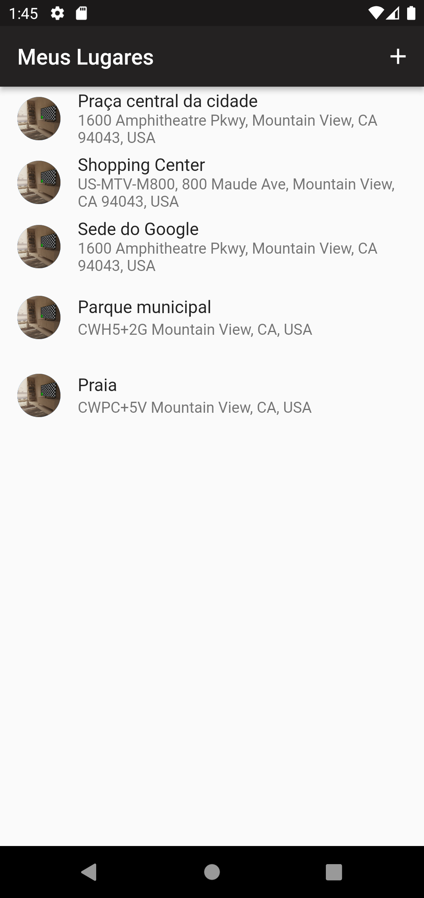
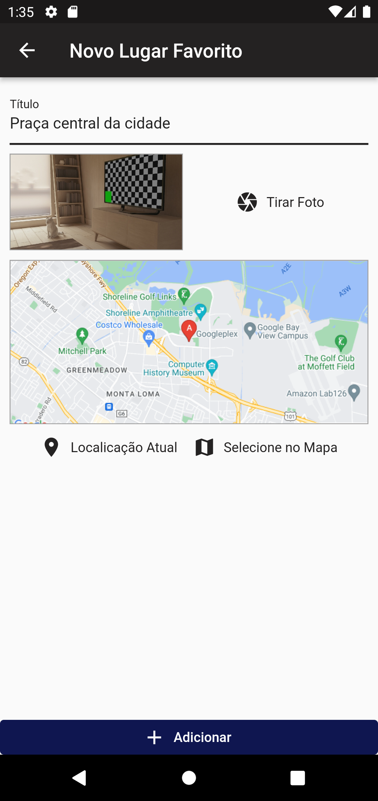
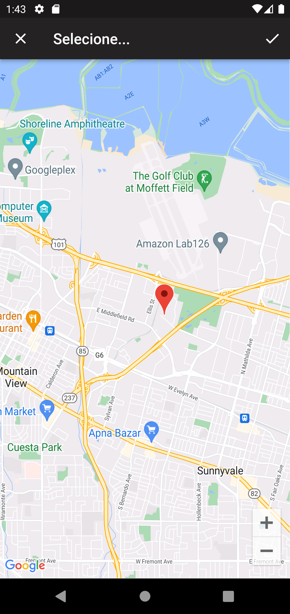
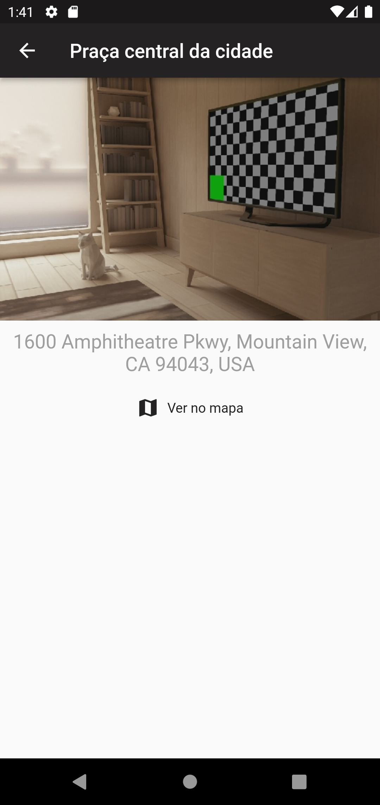

# Great Places - Flutter App

    
    

Great Places is a Flutter mobile app project created for learning and practicing mobile development using Flutter. The main purpose of this project is to learn and practice using native resources of smartphones using Flutter.

The app allows users to add places they have visited to a list of favorite places, including the location and an image of the place. It uses native resources such as the camera and device location to achieve this functionality.

## Features

- Add places to a list of favorite places with a name, image, and location.
- Use the device's camera to take pictures of the place.
- Use the device's location to automatically populate the location of the place.
- View a list of favorite places and their details, including the image and location.

## Technologies Used

- Flutter
- Dart

## Getting Started

To run this app on your machine, follow these steps:

1. Clone this repository to your local machine.
2. Open the project directory in a code editor.
3. Run `flutter pub get` to install the project dependencies.
4. Define a value for the `API_KEY` key in a `.env` file to access the Google Maps APIs.
5. Connect a device or start an emulator.
6. Run `flutter run` to launch the app on your device or emulator.
7. Run `flutter build apk` to build the app for android so.

## Screenshots

    
    
    
    

## Contributions

Contributions are always welcome! If you find any issues or have suggestions for improvements, feel free to open an issue or a pull request.

## License

This project is licensed under the [MIT License](LICENSE).
